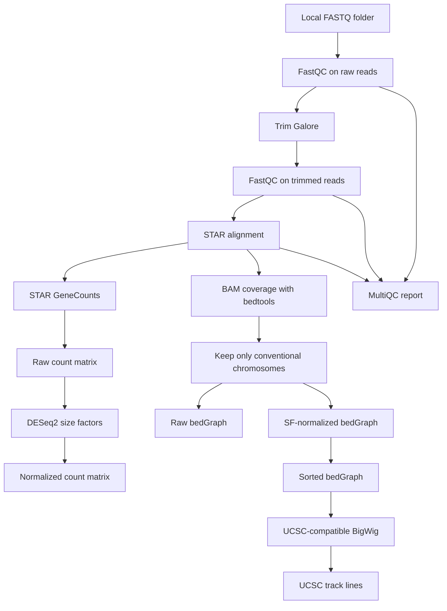

# RNAseq2tracks v2

A simple, GitHub-ready RNA-seq preprocessing workflow that starts from local FASTQ files and produces STAR alignments, gene count matrices, QC reports, and UCSC-friendly BigWig tracks for visualization.

The repository is modeled as a small command-line workflow: one master script, modular helper scripts, documented configuration, and separate docs for installation, outputs, upload, and known limitations.

## Workflow schematic



## What v2 changes

Version 2 adds a safety filter for genome browser tracks. BigWig files are now generated only from conventional chromosomes:

- human UCSC style: `chr1`-`chr22`, `chrX`, `chrY`, `chrM`
- mouse UCSC style: `chr1`-`chr19`, `chrX`, `chrY`, `chrM`
- human Ensembl style: `1`-`22`, `X`, `Y`, `MT`
- mouse Ensembl style: `1`-`19`, `X`, `Y`, `MT`

This removes alternative contigs, random scaffolds, decoys, unplaced contigs, and other non-standard references before BigWig conversion.

## Quick start

Edit `config/config.sh` first, then run:

```bash
chmod +x RNAfastq2tracks.sh scripts/*.sh scripts/*.R
./RNAfastq2tracks.sh <input_fastq_dir> <output_dir> <max_jobs> <human|mouse> [paired|single] [samplesheet.csv]
```

Example for paired-end data:

```bash
./RNAfastq2tracks.sh ./fastq ./results 8 human paired samplesheet.csv
```

Expected paired FASTQ naming:

```text
KO_12_1_1__ERR14875937_1.fq.gz
KO_12_1_2__ERR14875937_2.fq.gz
```

## Main outputs

The output folder created by the workflow contains:

```text
fastqc_raw/          FastQC reports before trimming
trimmed/             Trim Galore FASTQ outputs
fastqc_trimmed/      FastQC reports after trimming
star/                STAR BAM files, logs, and ReadsPerGene.out.tab files
counts/              raw and normalized count matrices
coverage/            bedGraph and BigWig coverage files
tracks/              UCSC track lines
reports/             MultiQC report
logs/                workflow logs
```

## Repository layout

```text
rnaseq2tracks_v2/
├── README.md
├── RNAfastq2tracks.sh
├── config/
│   └── config.sh
├── scripts/
│   ├── run_fastqc.sh
│   ├── run_trimming.sh
│   ├── run_star.sh
│   ├── run_gene_counts.sh
│   ├── run_normalization.R
│   ├── run_coverage.sh
│   ├── run_multiqc.sh
│   └── create_ucsc_tracks.sh
├── docs/
│   ├── specification.md
│   ├── reuse_map.md
│   ├── repository_tree.md
│   ├── upload_instructions.md
│   ├── checklist.md
│   ├── report.pdf
│   └── schematics/
│       └── workflow_schematic.mmd
├── examples/
│   └── samplesheet.example.csv
├── tests/
│   └── smoke_test.md
├── .gitignore
├── LICENSE
└── CITATION.cff
```

## Configuration

All machine-specific settings live in:

```text
config/config.sh
```

You must edit this file before running the workflow. The most important variables are:

- `STAR_INDEX_HUMAN`, `STAR_INDEX_MOUSE`
- `GTF_HUMAN`, `GTF_MOUSE`
- `CHROM_SIZES_HUMAN`, `CHROM_SIZES_MOUSE`
- `CHROMOSOME_NAMING`, set to `ucsc` or `ensembl`
- `REGULAR_CHROMS_ONLY`, set to `true` by default
- paths to `STAR`, `FastQC`, `Trim Galore`, `bedtools`, `bedGraphToBigWig`, `MultiQC`, and `Rscript`

## Dependencies

The workflow expects these tools to be available:

- Bash and GNU core utilities
- GNU Parallel
- STAR
- FastQC
- Trim Galore
- bedtools
- Kent utils `bedGraphToBigWig`
- MultiQC
- R with DESeq2

## Important notes

- BigWig files are normalized and filtered to conventional chromosomes in v2.
- Raw counts from STAR are the correct input for downstream differential expression.
- Normalized counts and BigWig tracks are useful for visualization and QC, not as direct statistical input for DESeq2 testing.
- The workflow starts from local FASTQ files only. It does not download SRA/GEO data.
- Generated BAM, FASTQ, bedGraph, BigWig, and report outputs should not be committed to GitHub.

## Documentation

See:

- `docs/specification.md` for technical design
- `docs/reuse_map.md` for script reuse notes
- `docs/repository_tree.md` for the full file tree
- `docs/upload_instructions.md` for GitHub upload steps
- `docs/checklist.md` for the deployment checklist
