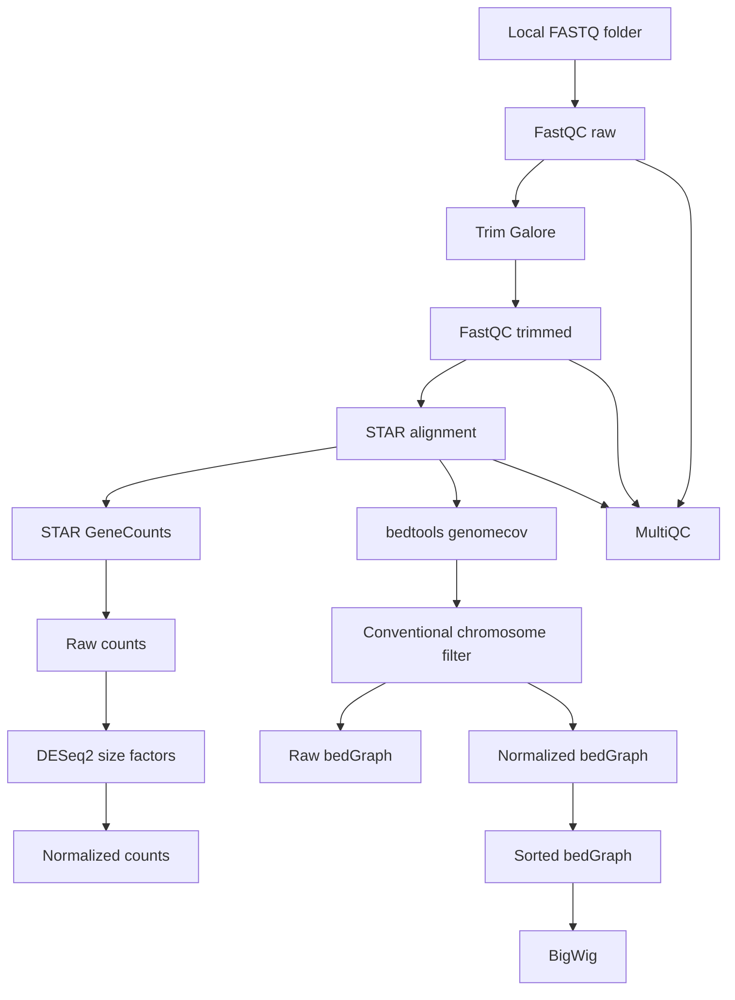

# RNAseq2tracks v2 specification

## Overview

RNAseq2tracks v2 is a simplified RNA-seq preprocessing workflow intended for inexperienced users who need a one-command route from local FASTQ files to STAR alignments, gene count matrices, QC reports, and UCSC-friendly coverage tracks.

Version 2 keeps the modular structure of v1 and adds a dedicated conventional-chromosome filter before BigWig creation. This prevents non-standard contigs, alternative haplotypes, random scaffolds, decoys, and unplaced references from appearing in the browser-ready BigWig files.

## Workflow design



## Version 2 changes

1. `scripts/run_coverage.sh` now filters coverage to conventional chromosomes before BigWig conversion.
2. `config/config.sh` now includes:
   - `REGULAR_CHROMS_ONLY="true"`
   - `CHROMOSOME_NAMING="ucsc"`
3. The README now has a GitHub-front-page workflow schematic and layout modeled after the style of the companion `fastq2tracks` repository.
4. The repository now includes `.gitignore`, `LICENSE`, `CITATION.cff`, `examples/`, `tests/`, and a Mermaid schematic file.

## Conventional chromosome rules

When `REGULAR_CHROMS_ONLY="true"`, the coverage script keeps only these chromosome names:

| Species | Naming | Kept chromosomes |
|---|---|---|
| human | ucsc | `chr1`-`chr22`, `chrX`, `chrY`, `chrM` |
| mouse | ucsc | `chr1`-`chr19`, `chrX`, `chrY`, `chrM` |
| human | ensembl | `1`-`22`, `X`, `Y`, `MT` |
| mouse | ensembl | `1`-`19`, `X`, `Y`, `MT` |

The default is UCSC naming because the goal is to create browser-friendly BigWig files.

## Input

The workflow starts from a local FASTQ directory. It supports paired-end or single-end mode through the fifth argument of the master script:

```bash
./RNAfastq2tracks.sh <input_fastq_dir> <output_dir> <max_jobs> <human|mouse> [paired|single] [samplesheet.csv]
```

Expected paired-end naming example:

```text
KO_12_1_1__ERR14875937_1.fq.gz
KO_12_1_2__ERR14875937_2.fq.gz
```

## Outputs

The workflow creates:

- FastQC reports before trimming
- Trim Galore outputs
- FastQC reports after trimming
- STAR sorted BAM files
- STAR `ReadsPerGene.out.tab` files
- raw count matrix
- DESeq2 size factors
- normalized count matrix
- raw bedGraph files after conventional-chromosome filtering
- normalized bedGraph files after conventional-chromosome filtering
- normalized BigWig files built only from conventional chromosomes
- MultiQC report
- UCSC track lines

## Notes on BigWig compatibility

The BigWig files created by v2 are safer for UCSC-style use because non-standard chromosomes are filtered out before conversion. Browser compatibility still requires that your `CHROM_SIZES_HUMAN` or `CHROM_SIZES_MOUSE` file uses the same naming convention as the BAM files. If your STAR index was built with UCSC-style names, use a UCSC-style `chrom.sizes` file. If your STAR index was built with Ensembl-style names, set `CHROMOSOME_NAMING="ensembl"` and use a matching chromosome size file.

## Limitations

- The workflow does not download data from SRA/GEO.
- The workflow does not build STAR indexes.
- The workflow does not perform full differential expression testing, although it prepares count matrices and normalization outputs.
- The current coverage script creates one BigWig per sample from the whole BAM. It does not split reads into separate plus/minus strand BigWig files unless further modified.
- Correct interpretation of strandedness still depends on correct sample metadata.

## Recommendation

Use v2 instead of v1 when you intend to upload BigWig tracks to UCSC or another browser that expects conventional chromosome names. Keep `REGULAR_CHROMS_ONLY="true"` unless you explicitly need alternative contigs or scaffold-level coverage.
